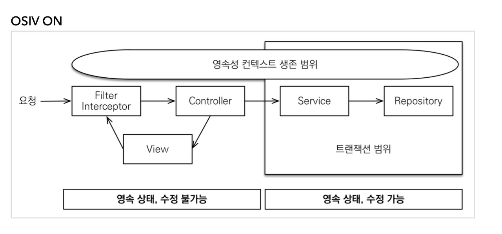
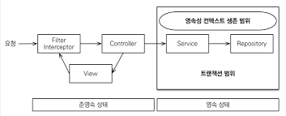

연관관계를 작성한다.

```java
class UserAccount {
    // UserAccount
}

class Article {
    // ...
    
    @Setter
    @ManyToOne(optional = false)
    private UserAccount userAccount;
    
    // ...
}

class ArticleComment {
    // ...

    @Setter
    @ManyToOne(optional = false)
    private UserAccount userAccount;
    
    // ...
}
```

<br>

OSIV (open session in View)

OSIV는 영속성 컨텍스트를 뷰까지 열어두는 기능이다. 영속성 컨텍스트가 유지되면 엔티티도 형속 상태로 유지된다. 뷰까지 영속성 컨텍스트가 살아있다면 뷰에서도 지연로딩을 사용할 수 있다.


스프링프레임워크가 제공하는 OSIV는 비즈니스 계증에서 트랜젝션을 사용하는 OSIV다.<br>
영속성 컨텍스트는 사용자의 요청 지점에서 생성이 되지만, 데이터를 쓰거나 수정할 수 있는 트랜젝션은 비즈니스 계층에서만 사용할 수 있도록 트랜잭션이 일어난다.

- 클라이언트의 요청이 들어오면 서블릿 필터나, 스프링 인터셉터에서 영속성 컨텍스트를 생성한다. 단 이 시점에서 트랜잭션은 시작하지 않는다.
- 서비스 계층에서 @Transeactional로 트랜잭션을 시작할 때 1번에서 미리 생성해둔 영속성 컨텍스트를 찾아와서 트랜잭션을 시작한다.
- 서비스 계층이 끝나면 트랜잭션을 커밋하고 영속성 컨텍스트를 플러시한다. 이 시점에 트랜잭션은 끝내지만 영속성 컨텍스트는 종료되지 않는다.
- 컨트롤러와 뷰까지 영속성 컨텍스트가 유지되므로 조회한 엔티티는 영속 상태를 유지한다.
- 서블릿 필터나, 스프링 인터셉터로 요청이 돌아오면 영속성 컨텍스트를 종료한다. 이때 플러시를 호출하지 않고 바로 종료한다.



<br>

OSIV ON

- spring.jpa.open-in-view: true (기본값)


단점

- 최초 데이터베이스 커넥션 시작 시점부터 API 응답이 끝날 때까지 영속성 컨텍스트와 데이터베이스 커넥션을 유지하기 떄문에, 실시간 트래픽이 중요한 애플리케이션에서는 커넥션이 모자랄 수 있다.



OSIV OFF

- spring.jpa.open-in-view: false

단점

- 모든 지연로딩을 트랜잭션 안에서 처리해야 한다. 따라서 지금까지 작성한 많은 지연로딩 코드를 트랜잭션 안으로 넣어야 하는 단점이 있다.


